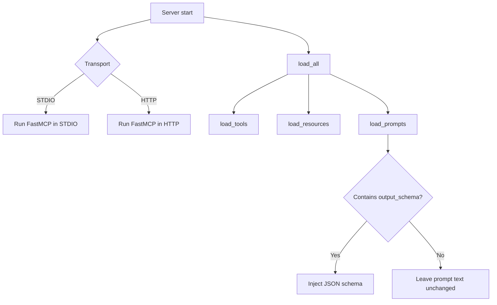

# Architecture

This project implements a FastMCP 2.x server with local STDIO and OpenShift HTTP transports, dynamic tooling, prompts with JSON schema injection, and OpenShift-native build/deploy.

- Core framework: FastMCP 2.x
- Transports: STDIO (local), HTTP (OpenShift)
- Dynamic loading: tools, resources, prompts
- Auth: optional JWT verification and scope checks
- OpenShift: ImageStream, BuildConfigs (Git or Binary), Deployment, Service, Route, HPA

## Components

- `src/core/app.py`: Instantiates `FastMCP` and shared logger
- `src/core/server.py`: Bootstraps logging, loads components, and runs server (STDIO or HTTP)
- `src/core/loaders.py`: Loads tools/resources/prompts from filesystem; injects JSON schemas into prompts; hot-reload in dev
- `src/core/auth.py`: Optional JWT verification and scope decorator
- `src/tools/*.py`: Example tools including sampling and elicitation
- `src/resources/*.py`: Example resource with explicit URI
- `src/tools/preview_prompt.py`: CLI to preview a prompt with injected schema and variable replacements
- `src/ops/deploy_cli.py`: Interactive OpenShift deployer using `oc`

## Runtime Flow (HTTP)

## Loading Flow

## OpenShift Build/Deploy

## Key Decisions

- Use FastMCP 2.x APIs: `FunctionPrompt.from_function(...)` + `mcp.add_prompt(...)`
- Resource registration requires explicit URI: `@mcp.resource("resource://...")`
- OpenShift-native builds: prefer Binary Build for local projects without Git; Git Build also supported
- Images pulled from internal registry `image-registry.openshift-image-registry.svc:5000/<ns>/<name>:latest`

## Configuration

Environment variables (selected):
- `MCP_TRANSPORT` (stdio|http)
- `MCP_HTTP_HOST`, `MCP_HTTP_PORT`, `MCP_HTTP_PATH`
- `MCP_HTTP_ALLOWED_ORIGINS`
- `MCP_AUTH_JWT_ALG`, `MCP_AUTH_JWT_SECRET`, `MCP_AUTH_JWT_PUBLIC_KEY`
- `MCP_REQUIRED_SCOPES`

## CLI Deployment

`mcp-deploy` prompts for namespace, app name, and HTTP settings, applies ImageStream/BuildConfig, performs a binary build, applies runtime manifests, sets env, waits for rollout, and prints the Route host.
