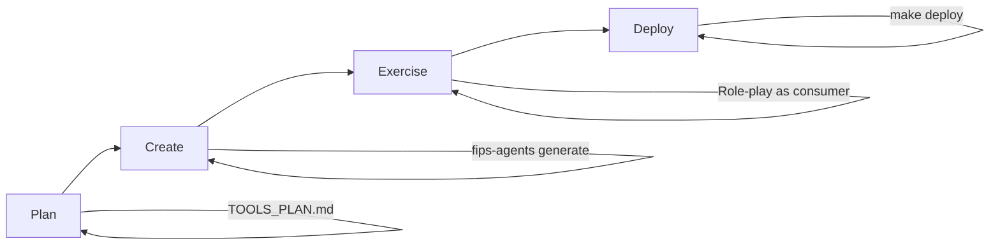

# Architecture

This project implements a FastMCP 2.x server with local STDIO and OpenShift HTTP transports, dynamic tooling, prompts with JSON schema injection, and OpenShift-native build/deploy.

- Core framework: FastMCP 2.x
- Transports: STDIO (local), HTTP (OpenShift)
- Dynamic loading: tools, resources, prompts, middleware
- Auth: optional JWT verification and scope checks
- Generator system: Jinja2 templates for scaffolding components
- OpenShift: ImageStream, BuildConfigs (Git or Binary), Deployment, Service, Route, HPA

## Components

- `src/core/app.py`: Instantiates `FastMCP` and shared logger; imports prompts module for decorator registration
- `src/core/server.py`: Bootstraps logging, loads components, and runs server (STDIO or HTTP)
- `src/core/loaders.py`: Loads tools/resources/prompts/middleware from filesystem; hot-reload in dev
- `src/core/auth.py`: Optional JWT verification and scope decorator
- `src/tools/*.py`: Example tools including sampling and elicitation
- `src/tools/advanced_examples.py`: Comprehensive examples of FastMCP best practices
- `src/resources/*.py`: Example resource with explicit URI
- `src/prompts/*.py`: Python-based prompts using FastMCP decorators (@mcp.prompt())
- `src/middleware/*.py`: Middleware for cross-cutting concerns (logging, auth, rate limiting, etc.)
- `src/tools/preview_prompt.py`: CLI to preview a prompt with injected schema and variable replacements
- `src/ops/deploy_cli.py`: Interactive OpenShift deployer using `oc`
- `.fips-agents-cli/generators/`: Jinja2 templates for generating new components

### Tools Best Practices (FastMCP 2.11.0+)

All tools follow FastMCP best practices:

- **Annotated Descriptions** (v2.11.0+): Use `Annotated[type, "description"]` for parameter documentation
- **Field Validation**: Use Pydantic `Field` for constraints (ranges, lengths, patterns)
- **Tool Annotations** (v2.2.7+): Provide hints about tool behavior:
  - `readOnlyHint`: Tool doesn't modify state
  - `idempotentHint`: Same inputs produce same outputs
  - `destructiveHint`: Tool performs destructive operations
  - `openWorldHint`: Tool accesses external systems
- **Structured Output** (v2.10.0+): Use dataclasses for complex return types
- **Error Handling**: Use `ToolError` for user-facing validation errors
- **Context Parameter**: Always include `ctx: Context = None` for logging and capabilities (sampling, elicitation)

## Runtime Flow (HTTP)


## Loading Flow


## OpenShift Build/Deploy


## Key Decisions

- Use FastMCP 2.x decorator APIs: `@mcp.prompt()` for Python-based prompts with type safety
- Python prompts in `src/prompts/` use Pydantic Field annotations for parameter descriptions
- Resource registration requires explicit URI: `@mcp.resource("resource://...")`
- Middleware uses `@mcp.middleware()` decorator for self-registration
- Generator templates use Jinja2 and live in project (not CLI) for customization
- OpenShift-native builds: prefer Binary Build for local projects without Git; Git Build also supported
- Images pulled from internal registry `image-registry.openshift-image-registry.svc:5000/<ns>/<name>:latest`

## Prompt System

Prompts are defined using Python decorators for better type safety and IDE support:

- Location: `src/prompts/` directory with `__init__.py`, `analysis.py`, `documentation.py`, `general.py`
- Pattern: Use `@mcp.prompt()` decorator on functions
- Type annotations: Use `Annotated[type, Field(...)]` from Pydantic for parameters
- Return types: Support `str`, `Message`, or `list[Message]`
- Hot-reload: Changes to prompt modules are automatically reloaded in dev mode

Example:
```python
from typing import Annotated
from pydantic import Field
from ..core.app import mcp

@mcp.prompt()
def summarize(
    document: Annotated[str, Field(description="The document text to summarize")],
) -> str:
    return f"Summarize the following text:\n<document>{document}</document>"
```

## Middleware System

Middleware wraps tool execution to add cross-cutting concerns like logging, authentication, rate limiting, etc.

- Location: `src/middleware/` directory
- Pattern: Use `@mcp.middleware()` decorator on async functions
- Signature: `async def middleware_name(ctx: Context, next_handler: Callable, *args, **kwargs) -> Any`
- Hot-reload: Changes to middleware modules are automatically reloaded in dev mode
- Self-registration: Middleware registers automatically when module is imported

Example:
```python
from typing import Any, Callable
from fastmcp import Context
from core.app import mcp

@mcp.middleware()
async def logging_middleware(
    ctx: Context,
    next_handler: Callable,
    *args: Any,
    **kwargs: Any
) -> Any:
    tool_name = ctx.request.tool_name
    print(f"Executing: {tool_name}")
    result = await next_handler(*args, **kwargs)
    print(f"Completed: {tool_name}")
    return result
```

## Generator System

The generator system scaffolds new components using Jinja2 templates stored in the project:

- Location: `.fips-agents-cli/generators/` directory
- Component types: tool, resource, prompt, middleware
- Templates: `component.py.j2` (implementation), `test.py.j2` (tests)
- Customization: Templates are per-project and can be customized
- CLI: `fips-agents generate <type> <name> [options]`

Key features:
- Generates both implementation and test files
- Includes TODO comments and examples
- Supports async/sync, authentication, context parameters
- Follows FastMCP best practices
- Templates use Jinja2 syntax for flexibility

See [GENERATOR_PLAN.md](GENERATOR_PLAN.md) for comprehensive generator documentation.

## Configuration

Environment variables (selected):
- `MCP_TRANSPORT` (stdio|http)
- `MCP_HTTP_HOST`, `MCP_HTTP_PORT`, `MCP_HTTP_PATH`
- `MCP_HTTP_ALLOWED_ORIGINS`
- `MCP_AUTH_JWT_ALG`, `MCP_AUTH_JWT_SECRET`, `MCP_AUTH_JWT_PUBLIC_KEY`
- `MCP_REQUIRED_SCOPES`

## CLI Deployment

`mcp-deploy` prompts for namespace, app name, and HTTP settings, applies ImageStream/BuildConfig, performs a binary build, applies runtime manifests, sets env, waits for rollout, and prints the Route host.

## Development Workflow

The recommended workflow for developing MCP tools follows these phases:



### Phase 1: Plan Tools (`/plan-tools`)

Before implementation:
1. Read Anthropic's tool design guidance
2. Create `TOOLS_PLAN.md` with specifications for each tool
3. Get approval before writing code

### Phase 2: Create Tools (`/create-tools`)

For each tool in the plan:
1. Generate scaffold with `fips-agents generate tool`
2. Implement the tool logic
3. Write comprehensive tests
4. Run tests to verify

### Phase 3: Exercise Tools (`/exercise-tools`)

Test ergonomics by role-playing as the consuming agent:
- Verify parameter names are intuitive
- Check that error messages help with recovery
- Ensure tools compose well together

### Phase 4: Deploy (`/deploy-mcp`)

Pre-deployment checklist:
1. Fix file permissions: `find src -name "*.py" -perm 600 -exec chmod 644 {} \;`
2. Run all tests
3. Deploy to OpenShift: `make deploy PROJECT=<name>`
4. Verify with `mcp-test-mcp`

## Known Issues

### File Permission Issue

Files created by Claude Code subagents may have `600` permissions, preventing the OpenShift container from reading them. Always run the permission fix before deployment:

```bash
find src -name "*.py" -perm 600 -exec chmod 644 {} \;
```

### Import Namespace Issue

Using relative imports or path manipulation can create dual FastMCP instances where tools register to one instance but the server runs another. Always use `src.` prefixed absolute imports:

```python
# Correct
from src.core.app import mcp

# Incorrect
from core.app import mcp
from .app import mcp
```
